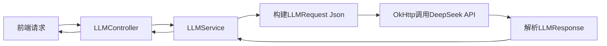

# NoteAI 项目技术文档

## 📖 项目概览

本项目是一个基于 **Spring Boot 3 + Vue 3 + MySQL** 的智能笔记管理平台，集成了 **DeepSeek 大语言模型** 实现 AI 辅助学习功能。平台支持三种角色：**学生**、**教师**、**管理员**，分别拥有不同的功能权限。

---

# 第一部分：后端接口与前端调用对应关系

---

## 1. UserController (/api/users) — 用户管理

**所在文件:** `src/main/java/com/noteaiBackend/controller/UserController.java`

| 接口方法 | URL | 功能 | 前端调用 | 操作说明 |
|---------|-----|------|---------|---------|
| **GET** | `/api/users` | 获取所有用户列表(基础) | 未直接使用 | 测试方法 |
| **GET** | `/api/users/page` | 分页获取所有用户 | 未直接使用 | 测试方法 |
| **GET** | `/api/users/{id}` | 根据ID获取用户详情 | `frontend/src/api/user.js` 第9行 `getUserInfo(userId)` | 用户在个人中心加载信息时调用 |
| **POST** | `/api/users` | 创建用户 | 未直接使用 | 测试方法 |
| **POST** | `/api/users/register` | 用户注册 | `RegisterView.vue` 中调用 | 注册新用户 |
| **PUT** | `/api/users/{id}` | 更新用户信息 | `AdminUserManagement.vue` 第128行 `handleUpdateUser()`<br>`frontend/src/api/user.js` 第16行 `updateUserInfo()` | 管理员编辑用户资料/用户修改个人信息 |
| **DELETE** | `/api/users/{id}` | 删除用户 | 未直接使用 | 测试方法 |
| **GET** | `/api/users/account/{userAccount}` | 按账号查询用户 | 未直接使用 | 测试方法 |
| **GET** | `/api/users/phone/{phone}` | 按手机号查询用户 | 未直接使用 | 测试方法 |
| **GET** | `/api/users/exists/account/{userAccount}` | 检查账号是否存在 | 注册时校验唯一性 | 测试方法 |
| **GET** | `/api/users/role/{role}` | 按角色查询用户列表 | 未直接使用 | 测试方法 |
| **GET** | `/api/users/role/{role}/page` | 按角色分页查询 | 未直接使用 | 测试方法 |
| **GET** | `/api/users/search` | 关键字搜索用户 | 未直接使用 | 测试方法 |
| **GET** | `/api/users/search/conditions` | 组合条件查询用户 | 未直接使用 | 测试方法 |
| **GET** | `/api/users/stats` | 获取用户统计信息 | 未直接使用 | 测试方法 |
| **PUT** | `/api/users/{id}/status` | 更新用户状态(封禁/解封) | `AdminUserManagement.vue` 第141行 `toggleUserStatus()` | 管理员封禁/解封用户 |
| **PUT** | `/api/users/{id}/role` | 更新用户角色 | 未直接使用 | 测试方法 |
| **PUT** | `/api/users/{id}/avatar` | 更新用户头像 | `frontend/src/api/user.js` 第27行 `updateAvatar()` | 用户更换头像 |
| **GET** | `/api/users/admin/list` | 管理员获取用户列表(分页+搜索) | `AdminUserManagement.vue` 第85行 `fetchUsers()` | 管理员打开用户管理页面时调用 |
| **PUT** | `/api/users/{id}/password` | 修改密码 | `frontend/src/api/user.js` 第23行 `updatePassword()` | 用户修改密码，验证旧密码 |
| **POST** | `/api/users/login` | 用户登录 | `LoginView.vue` 第38行 `handleLogin()` | 用户登录，返回token和用户信息 |
| **PUT** | `/api/users/batch/status` | 批量更新用户状态 | 未直接使用 | 测试方法 |

### 🔐 用户登录流程
```
前端 LoginView.vue → POST /api/users/login 
  → UserService.login() → BCrypt校验密码 
  → 更新最后登录时间 → 返回 {user, token, loginTime}
  → 前端存入 Pinia Store + localStorage
```

### 🔒 密码修改流程
```
前端 用户设置页面 → PUT /api/users/{id}/password?oldPassword=&newPassword=
  → UserService.updatePassword() → BCrypt验证旧密码 → BCrypt加密新密码
```

---

## 2. NoteController (/api/note) — 笔记管理

**所在文件:** `src/main/java/com/noteaiBackend/controller/NoteController.java`

| 接口方法 | URL | 功能 | 前端调用 | 操作说明 |
|---------|-----|------|---------|---------|
| **GET** | `/api/note` | 获取所有笔记 | 未直接使用 | 测试方法 |
| **GET** | `/api/note/{id}` | 获取笔记详情 | `frontend/src/api/student.js` 第66行 `getNoteDetail(noteId)` | 查看笔记内容 |
| **GET** | `/api/note/public` | 获取公开笔记列表(分页) | `frontend/src/api/student.js` 第59行 `getPublicNotes()`<br>`PublicNotesView.vue` | 学生浏览公开笔记 |
| **POST** | `/api/note` | 创建自由笔记(不关联作业) | `frontend/src/api/student.js` 第48行 `createFreeNote(noteData)` | 学生创建自由笔记 |
| **POST** | `/api/note/{taskId}` | 创建作业笔记(关联作业) | `frontend/src/api/student.js` 第56行 `createAssignmentNote(taskId, noteData)` | 学生提交作业笔记 |
| **GET** | `/api/note/admin/list` | 管理员获取笔记列表 | `AdminNoteManagement.vue` | 管理员管理笔记 |
| **DELETE** | `/api/note/{id}` | 删除笔记 | 管理员删除违规笔记 | 物理删除 |
| **GET** | `/api/note/byTaskId/{id}` | 根据作业ID查笔记 | 教师查看作业提交 | 用于教师批改 |
| **GET** | `/api/note/excellent/{classId}` | 获取课程优秀笔记 | `frontend/src/api/student.js` 第43行 `getExcellentNotes(classId)`<br>`StudentCourseDetail.vue` 第245行 | 展示优秀笔记 |
| **PUT** | `/api/note/{id}` | 更新笔记 | `frontend/src/api/student.js` 第73行 `updateNote(noteId, noteData)` | 编辑笔记内容 |
| **GET** | `/api/note/user/{userId}` | 获取用户笔记列表 | `frontend/src/api/student.js` 第84行 `getUserNotes(userId)`<br>`StudentNotesView.vue` | 查看自己的笔记 |
| **PUT** | `/api/note/is_score/{id}` | 标记笔记为已批改 | 教师批改完成后调用 | 更新评分状态 |
| **PUT** | `/api/note/{id}/status` | 更新笔记状态(屏蔽/公开) | 管理员操作 | 屏蔽违规笔记 |

---

## 3. ClazzController (/api/class) — 班级/课程管理

**所在文件:** `src/main/java/com/noteaiBackend/controller/ClazzController.java`

| 接口方法 | URL | 功能 | 前端调用 | 操作说明 |
|---------|-----|------|---------|---------|
| **GET** | `/api/class/admin/list` | 管理员获取全平台班级列表(含教师名+学生数) | `AdminClassManagement.vue` | 管理员管理班级 |
| **GET** | `/api/class` | 获取所有课程 | `frontend/src/api/student.js` 第80行 `getAllCourses()` | 获取全部课程列表 |
| **GET** | `/api/class/{id}` | 根据ID获取课程详情 | `frontend/src/api/student.js` 第21行 `getCourseDetail(classId)`<br>`StudentCourseDetail.vue` 第253行 | 展示课程信息 |
| **POST** | `/api/class` | 新建课程 | 教师创建课程 | 教师新建课程 |
| **PUT** | `/api/class/{id}` | 编辑课程信息 | 教师编辑课程 | 更新课程信息 |
| **DELETE** | `/api/class/{id}` | 删除课程 | 未直接使用 | 测试方法 |
| **GET** | `/api/class/withStudentCount/{id}` | 获取教师的课程列表(含学生数) | `TeacherCourseManagement.vue` | 教师查看自己的课程(统计) |
| **PUT** | `/api/class/{id}/status` | 更新班级状态(屏蔽/取消) | 管理员操作 | 屏蔽违规班级 |
| **GET** | `/api/class/teacher/{teacherId}` | 根据教师ID获取班级列表 | `TeacherCourseManagement.vue` | 教师查看我的课程 |

---

## 4. TaskController (/api/task) — 作业/任务管理

**所在文件:** `src/main/java/com/noteaiBackend/controller/TaskController.java`

| 接口方法 | URL | 功能 | 前端调用 | 操作说明 |
|---------|-----|------|---------|---------|
| **GET** | `/api/task` | 获取所有作业 | 未直接使用 | 测试方法 |
| **GET** | `/api/task/{id}` | 获取作业详情 | 未直接使用 | 测试方法 |
| **POST** | `/api/task` | 创建作业 | `TeacherAssignmentManagement.vue` | 教师新建作业 |
| **PUT** | `/api/task/{id}` | 更新作业 | `TeacherAssignmentManagement.vue` | 教师编辑作业 |
| **DELETE** | `/api/task/{id}` | 删除作业 | 未直接使用 | 测试方法 |
| **GET** | `/api/task/byTeacherId/{id}` | 教师查看自己的作业 | `TeacherAssignmentManagement.vue` | 教师查看作业列表 |
| **GET** | `/api/task/byTeacherIdWithClass/{id}` | 教师查看作业(含课程名) | `TeacherCourseManagement.vue` | 课程下的作业展示 |
| **GET** | `/api/task/byClassId/{id}` | 根据班级查作业 | 未直接使用 | 测试方法 |
| **GET** | `/api/task/byClassId/{class_id}/{user_id}` | 学生查看课程作业(含笔记状态) | `frontend/src/api/student.js` 第32行 `getCourseAssignments(classId,userId)`<br>`StudentCourseDetail.vue` 第267行 | 学生查看课程作业列表 |

---

## 5. ReportController (/api/reports) — 举报管理

**所在文件:** `src/main/java/com/noteaiBackend/controller/ReportController.java`

| 接口方法 | URL | 功能 | 前端调用 | 操作说明 |
|---------|-----|------|---------|---------|
| **GET** | `/api/reports` | 获取所有举报 | `AdminReportManagement.vue` | 管理员查看举报列表 |
| **GET** | `/api/reports/type/{type}` | 按类型获取举报(1=用户,2=笔记,3=课程) | `AdminReportManagement.vue` | 按类型筛选 |
| **GET** | `/api/reports/users` | 获取用户举报 | 未直接使用 | 筛选类型=1 |
| **GET** | `/api/reports/notes` | 获取笔记举报 | 未直接使用 | 筛选类型=2 |
| **GET** | `/api/reports/classes` | 获取课程举报 | 未直接使用 | 筛选类型=3 |
| **POST** | `/api/reports` | 提交举报 | `frontend/src/api/student.js` 第78行 `submitReport(data)`<br>`StudentCourseDetail.vue` 第172行 `submitReport()` | 用户举报违规内容 |
| **PUT** | `/api/reports/{id}/status` | 更新举报状态 | `AdminReportManagement.vue` | 管理员处理举报 |
| **DELETE** | `/api/reports/{id}` | 删除举报 | `AdminReportManagement.vue` | 管理员删除 |
| **DELETE** | `/api/reports/batch` | 批量删除举报 | `AdminReportManagement.vue` | 一键清理 |
| **GET** | `/api/reports/type/{type}/target/{typeId}` | 根据类型和目标ID查记录 | 未直接使用 | 测试方法 |
| **GET** | `/api/reports/statistics` | 获取举报统计信息 | `AdminReportManagement.vue` | 统计面板 |

### 📝 举报类型说明
```
type = 1 → 举报用户
type = 2 → 举报笔记
type = 3 → 举报课程
```

---

## 6. LLMController (/api/llm) — 大语言模型接口

**所在文件:** `src/main/java/com/noteaiBackend/controller/LLMController.java`

| 接口方法 | URL | 功能 | 前端调用 | 操作说明 |
|---------|-----|------|---------|---------|
| **POST** | `/api/llm/ask-note` | 基于笔记内容问答(RAG) | `NoteDetailView.vue` | 用户对笔记内容提问，AI基于笔记回答 |
| **POST** | `/api/llm/summarize-note` | 分段总结大文本笔记 | 未直接使用 | 长笔记自动分段总结 |
| **POST** | `/api/llm/custom-prompt` | 自定义提示词调用AI | `polish_note` 润色笔记 | 润色笔记、分析学情等 |
| **GET** | `/api/llm/test` | 测试AI连接 | 测试用 | 直接传prompt测试大模型 |

---

## 7. NoteCommentController (/api/note-comments) — 笔记批改/评论

**所在文件:** `src/main/java/com/noteaiBackend/controller/NoteCommentController.java`

| 接口方法 | URL | 功能 | 前端调用 | 操作说明 |
|---------|-----|------|---------|---------|
| **GET** | `/api/note-comments` | 获取所有评语 | 未直接使用 | 测试方法 |
| **GET** | `/api/note-comments/{id}` | 获取评语详情 | 未直接使用 | 测试方法 |
| **POST** | `/api/note-comments` | 创建评语 | 教师提交批改 | 教师对学生笔记打分写评语 |
| **PUT** | `/api/note-comments/{id}` | 更新评语 | 未直接使用 | 测试方法 |
| **DELETE** | `/api/note-comments/{id}` | 删除评语 | 未直接使用 | 测试方法 |
| **GET** | `/api/note-comments/note/{noteId}` | 根据笔记ID获取评语 | `frontend/src/api/student.js` 第119行 `getNoteComments(noteId)`<br>`StudentCourseDetail.vue` 第67行 | 学生查看教师评语 |
| **PUT** | `/api/note-comments/noteId/{id}` | 根据笔记ID更新评语 | 教师批改完成后调用 | 教师提交批改评分 |

---

## 8. NoteInteractionController (/api/note-interactions) — 笔记互动

**所在文件:** `src/main/java/com/noteaiBackend/controller/NoteInteractionController.java`

| 接口方法 | URL | 功能 | 前端调用 | 操作说明 |
|---------|-----|------|---------|---------|
| **POST** | `/api/note-interactions/note/{noteId}/user/{userId}/view` | 记录查看笔记 | `frontend/src/api/student.js` 第113行 `viewNote(noteId, userId)` | 用户浏览笔记时触发 |
| **POST** | `/api/note-interactions/note/{noteId}/user/{userId}/like` | 点赞笔记 | 未直接使用 | 点赞 |
| **POST** | `/api/note-interactions/note/{noteId}/user/{userId}/cancel-like` | 取消点赞 | 未直接使用 | 取消点赞 |
| **POST** | `/api/note-interactions/note/{noteId}/user/{userId}/toggle-like` | 切换点赞状态 | `frontend/src/api/student.js` 第107行 `toggleNoteLike(noteId, userId)` | 点赞/取消点赞切换 |
| **GET** | `/api/note-interactions/note/{noteId}/view-count` | 获取查看次数 | `frontend/src/api/student.js` 第93行 `getNoteViewCount(noteId)` | 展示笔记热度 |
| **GET** | `/api/note-interactions/note/{noteId}/like-count` | 获取点赞次数 | `frontend/src/api/student.js` 第100行 `getNoteLikeCount(noteId)` | 展示笔记点赞数 |
| **GET** | `/api/note-interactions/note/{noteId}/user/{userId}/has-viewed` | 检查是否已查看 | 判断是否需要新增浏览记录 | 避免重复记录 |
| **GET** | `/api/note-interactions/note/{noteId}/user/{userId}/has-liked` | 检查是否已点赞 | 初始化点赞状态 | 页面加载时检查 |
| **GET** | `/api/note-interactions/note/{noteId}/user/{userId}/status` | 获取互动状态综合 | `frontend/src/api/student.js` 第86行 `getUserNoteInteractionStatus(noteId, userId)` | 获取浏览+点赞状态 |

---

## 9. ClassJoinedController (/api/class-joined) — 学生加课

**所在文件:** `src/main/java/com/noteaiBackend/controller/ClassJoinedController.java`

| 接口方法 | URL | 功能 | 前端调用 | 操作说明 |
|---------|-----|------|---------|---------|
| **GET** | `/api/class-joined/byStudentId/{id}` | 获取学生已加入课程(含教师名) | `frontend/src/api/student.js` 第8行 `getStudentCourses(studentId)`<br>`StudentCourseOverview.vue` | 学生查看我的课程 |
| **POST** | `/api/class-joined` | 学生加入课程 | `frontend/src/api/student.js` 第15行 `joinCourse({classId, studentId})` | 学生扫码/搜索加入课程 |
| **DELETE** | `/api/class-joined/{id}` | 退出课程 | 未直接使用 | 测试方法 |

---

## 10. 其他控制器（CRUD基础方法）

### FileController (/api/files)
| 接口 | URL | 功能 | 前端调用 |
|------|-----|------|---------|
| POST | `/api/files/upload` | 上传文件(图片等) | `frontend/src/api/common.js` 第13行 `uploadFile()` |
| GET | `/api/files/download/{fileName}` | 下载/预览文件 | 图片显示 |

### NoteVersionController (/api/note-version)
| 接口 | URL | 前端调用 |
|------|-----|---------|
| POST | `/api/note-version` | 创建新版本 |
| GET | `/api/note-version/note/{noteId}` | 获取笔记所有版本 |
| GET | `/api/note-version/note/{noteId}/version/{version}` | 获取特定版本 |
| GET | `/api/note-version/note/{noteId}/latest` | 获取最新版本 |
| POST | `/api/note-version/note/{noteId}/revert/{version}` | 回退到某版本 |
| GET | `/api/note-version/note/{noteId}/compare` | 比较两个版本差异 |

### TeacherCourseController (/api/teacher/courses)
| 接口 | URL | 功能 | 前端调用 |
|------|-----|------|---------|
| GET | `/api/teacher/courses/{classId}/details` | 课程详情统计+学生名单 | `TeacherCourseManagement.vue` |
| GET | `/api/teacher/courses/tasks/{taskId}/submissions-status` | 作业提交状态 | `TeacherCourseManagement.vue` |

### StudentHomeController (/api/student/home)
| 接口 | URL | 功能 | 前端调用 |
|------|-----|------|---------|
| GET | `/api/student/home/data?userId=` | 学生首页(热门笔记+待完成作业) | `StudentHome.vue` |

### TagController (/api/tag)
| 接口 | URL | 功能 | 前端调用 |
|------|-----|------|---------|
| GET | `/api/tag/search?keyword=` | 标签模糊搜索 | `frontend/src/api/common.js` 第7行 `searchTags(keyword)` |

### AssignmentSummaryController (/api/assignment-summary)
| 接口 | URL | 功能 | 前端调用 |
|------|-----|------|---------|
| GET | `/api/assignment-summary/{classId}` | 获取班级作业AI总结 | 未直接使用 |
| POST | `/api/assignment-summary/{classId}/generate` | AI生成班级作业总结 | 未直接使用 |

---

# 第二部分：API POSTMAN 测试用例

> 以下测试用例可导入 API POST / Postman 等工具中批量测试。  
> **服务器地址:** `http://localhost:8081`

## 1️⃣ 用户管理测试

### 1.1 注册新用户
```
POST http://localhost:8081/api/users/register
Content-Type: application/json

{
  "username": "测试学生",
  "userAccount": "test001",
  "password": "123456",
  "realName": "张三",
  "phone": "13800138001",
  "gender": 1,
  "age": 20,
  "role": 1
}
```
> role: 1=学生, 2=教师, 3=管理员

### 1.2 用户登录
```
POST http://localhost:8081/api/users/login
Content-Type: application/json

{
  "userAccount": "test001",
  "password": "123456",
  "role": "student"
}
```
> role: "student"/"teacher"/"admin"（与注册的role对应）

### 1.3 管理员获取用户列表（分页+搜索）
```
GET http://localhost:8081/api/users/admin/list?page=1&size=10&query=
```

### 1.4 获取用户详情
```
GET http://localhost:8081/api/users/1
```

### 1.5 更新用户信息
```
PUT http://localhost:8081/api/users/1
Content-Type: application/json

{
  "username": "新用户名",
  "realName": "新名字",
  "phone": "13900139001",
  "signature": "这个人很懒，什么都没写"
}
```

### 1.6 封禁/解封用户
```
PUT http://localhost:8081/api/users/1/status?status=0
```
> status=0 封禁, status=1 解封

### 1.7 修改密码
```
PUT http://localhost:8081/api/users/1/password?oldPassword=123456&newPassword=654321
```

### 1.8 更新头像
```
PUT http://localhost:8081/api/users/1/avatar?avatarUrl=http://example.com/avatar.jpg
```

### 1.9 检查账号是否存在
```
GET http://localhost:8081/api/users/exists/account/test001
```

### 1.10 按角色查询用户
```
GET http://localhost:8081/api/users/role/1
```

## 2️⃣ 课程/班级管理测试

### 2.1 获取所有课程
```
GET http://localhost:8081/api/class
```

### 2.2 获取课程详情
```
GET http://localhost:8081/api/class/1
```

### 2.3 创建课程
```
POST http://localhost:8081/api/class
Content-Type: application/json

{
  "className": "数据结构与算法",
  "teacherId": 2,
  "classCode": "CS101",
  "describe": "本课程涵盖常见数据结构和经典算法"
}
```

### 2.4 更新课程
```
PUT http://localhost:8081/api/class/1
Content-Type: application/json

{
  "className": "数据结构与算法（2024秋）",
  "describe": "更新后的课程描述"
}
```

### 2.5 删除课程
```
DELETE http://localhost:8081/api/class/1
```

### 2.6 获取教师的课程列表（含学生数）
```
GET http://localhost:8081/api/class/withStudentCount/2
```

### 2.7 管理员获取全平台课程列表
```
GET http://localhost:8081/api/class/admin/list
```

## 3️⃣ 学生加课测试

### 3.1 获取学生已加入课程
```
GET http://localhost:8081/api/class-joined/byStudentId/1
```

### 3.2 学生加入课程
```
POST http://localhost:8081/api/class-joined
Content-Type: application/json

{
  "classId": 1,
  "studentId": 1
}
```

## 4️⃣ 作业管理测试

### 4.1 创建作业
```
POST http://localhost:8081/api/task
Content-Type: application/json

{
  "title": "第一次作业：线性表",
  "classId": 1,
  "teacherId": 2,
  "deadline": "2024-12-31T23:59:59",
  "description": "请实现一个动态数组"
}
```

### 4.2 获取课程作业（学生端）
```
GET http://localhost:8081/api/task/byClassId/1/1
```

### 4.3 查看教师作业列表（含课程信息）
```
GET http://localhost:8081/api/task/byTeacherIdWithClass/2
```

### 4.4 根据课程查作业
```
GET http://localhost:8081/api/task/byClassId/1
```

### 4.5 更新作业
```
PUT http://localhost:8081/api/task/1
Content-Type: application/json

{
  "title": "第一次作业：线性表（已更新）",
  "deadline": "2025-01-15T23:59:59"
}
```

## 5️⃣ 笔记管理测试

### 5.1 获取笔记详情
```
GET http://localhost:8081/api/note/1
```

### 5.2 创建自由笔记
```
POST http://localhost:8081/api/note
Content-Type: application/json

{
  "userId": 1,
  "title": "第一次课笔记",
  "content": "今天学习了线性表的概念...",
  "isPublic": 1
}
```

### 5.3 创建作业笔记
```
POST http://localhost:8081/api/note/1
Content-Type: application/json

{
  "userId": 1,
  "title": "作业1答案",
  "content": "我的作业答案...",
  "isPublic": 0
}
```

### 5.4 更新笔记
```
PUT http://localhost:8081/api/note/1
Content-Type: application/json

{
  "title": "修改后的标题",
  "content": "修改后的内容...",
  "isPublic": 1
}
```

### 5.5 获取公开笔记列表
```
GET http://localhost:8081/api/note/public?page=1&size=12
```

### 5.6 获取课程优秀笔记
```
GET http://localhost:8081/api/note/excellent/1
```

### 5.7 获取用户笔记列表
```
GET http://localhost:8081/api/note/user/1?page=1&size=12
```

### 5.8 删除笔记
```
DELETE http://localhost:8081/api/note/1
```

### 5.9 标记笔记已批改
```
PUT http://localhost:8081/api/note/is_score/1
```

### 5.10 管理员获取笔记列表
```
GET http://localhost:8081/api/note/admin/list?page=1&size=10&query=
```

## 6️⃣ 笔记互动测试

### 6.1 查看笔记（记录浏览）
```
POST http://localhost:8081/api/note-interactions/note/1/user/1/view
```

### 6.2 点赞笔记
```
POST http://localhost:8081/api/note-interactions/note/1/user/1/toggle-like
```

### 6.3 获取查看次数
```
GET http://localhost:8081/api/note-interactions/note/1/view-count
```

### 6.4 获取点赞次数
```
GET http://localhost:8081/api/note-interactions/note/1/like-count
```

### 6.5 获取互动状态
```
GET http://localhost:8081/api/note-interactions/note/1/user/1/status
```

## 7️⃣ 教师批改测试

### 7.1 提交批改评语
```
POST http://localhost:8081/api/note-comments
Content-Type: application/json

{
  "noteId": 1,
  "teacherId": 2,
  "score": 95,
  "comment": "写得非常好，逻辑清晰！",
  "isScore": 1
}
```

### 7.2 获取笔记评语
```
GET http://localhost:8081/api/note-comments/note/1
```

### 7.3 更新评语（根据笔记ID）
```
PUT http://localhost:8081/api/note-comments/noteId/1
Content-Type: application/json

{
  "score": 98,
  "comment": "修改后的评语",
  "isScore": 1
}
```

### 7.4 教师课程详情
```
GET http://localhost:8081/api/teacher/courses/1/details
```

### 7.5 作业提交状态
```
GET http://localhost:8081/api/teacher/courses/tasks/1/submissions-status
```

## 8️⃣ 举报功能测试

### 8.1 提交举报
```
POST http://localhost:8081/api/reports?type=2&typeId=1&userId=1&info=这篇笔记涉嫌抄袭
```
> type: 1=用户, 2=笔记, 3=课程

### 8.2 获取所有举报
```
GET http://localhost:8081/api/reports
```

### 8.3 按类型获取举报
```
GET http://localhost:8081/api/reports/type/2
```

### 8.4 处理举报（更新状态）
```
PUT http://localhost:8081/api/reports/1/status?status=1
```
> status: 0=待处理, 1=已处理, 2=驳回

### 8.5 删除举报
```
DELETE http://localhost:8081/api/reports/1
```

### 8.6 批量删除举报
```
DELETE http://localhost:8081/api/reports/batch
Content-Type: application/json

[1, 2, 3]
```

### 8.7 举报统计
```
GET http://localhost:8081/api/reports/statistics
```

## 9️⃣ 文件上传测试

### 9.1 上传文件
```
POST http://localhost:8081/api/files/upload
Content-Type: multipart/form-data

file: [选择文件]
```

## 🔟 大语言模型测试

### 10.1 测试AI连接
```
GET http://localhost:8081/api/llm/test?prompt=请用中文说你好
```

### 10.2 基于笔记问答
```
POST http://localhost:8081/api/llm/ask-note
Content-Type: application/json

{
  "noteContent": "今天学习了数组、链表和栈三种数据结构。数组是连续存储，链表通过指针链接，栈是先进后出的结构。",
  "userQuestion": "栈的特点是什么？"
}
```

### 10.3 笔记分段总结
```
POST http://localhost:8081/api/llm/summarize-note
Content-Type: text/plain

(这里放入一段很长的笔记文本内容)
```

### 10.4 自定义提示词
```
POST http://localhost:8081/api/llm/custom-prompt
Content-Type: application/json

{
  "promptType": "polish_note",
  "dataId": 1
}
```
> promptType: "polish_note"(润色笔记), "analyze_student_performance"(分析学情)

## 1️⃣1️⃣ 笔记版本管理

### 11.1 创建版本
```
POST http://localhost:8081/api/note-version
Content-Type: application/json

{
  "noteId": 1,
  "content": "版本内容...",
  "userId": 1
}
```

### 11.2 获取所有版本
```
GET http://localhost:8081/api/note-version/note/1
```

### 11.3 回退版本
```
POST http://localhost:8081/api/note-version/note/1/revert/1?userId=1
```

---

# 第三部分：核心技术详解

---

## 1. ✅ 密码安全：BCrypt 加密算法

**使用位置:** `src/main/java/com/noteaiBackend/config/PasswordConfig.java` + `UserService.java`

### 什么是BCrypt？
BCrypt 是一种**密码哈希函数**，专门用于密码的安全存储。与普通加密不同，BCrypt 是**单向哈希**（无法解密还原原文）。

### 项目中的实现

```java
// PasswordConfig.java - 配置BCrypt为Spring Bean
@Configuration
public class PasswordConfig {
    @Bean
    public BCryptPasswordEncoder passwordEncoder() {
        return new BCryptPasswordEncoder();
    }
}
```

**注册时加密：**
```java
// UserService.java - 注册
String encodedPassword = passwordEncoder.encode(request.getPassword());
user.setPassword(encodedPassword); // 存加密后的密码
```

**登录时校验：**
```java
// UserService.java - 登录验证
boolean matches = passwordEncoder.matches(request.getPassword(), user.getPassword());
```

**改密码时：**
```java
// UserService.java - 修改密码
// 1. 验证旧密码
if (!passwordEncoder.matches(oldPassword, user.getPassword())) {
    throw new RuntimeException("原密码错误");
}
// 2. 加密新密码
user.setPassword(passwordEncoder.encode(newPassword));
```

### 为什么用BCrypt？
1. **自动加盐（Salt）**：每次加密结果都不同，即使密码相同
2. **可调节强度**：项目运行越来越快，BCrypt越来越慢（对抗暴力破解）
3. **不可逆**：无法从哈希值还原密码

---

## 2. 🖥️ 前端技术：Vue 3 语法详解

本项目使用 **Vue 3 Composition API + `<script setup>` 语法**。

### 核心概念

#### 2.1 响应式数据
```javascript
<script setup>
import { ref, reactive } from 'vue'

// ref: 用于基本类型（string, number, boolean）
const count = ref(0)           // 声明
count.value = 1                // 修改（必须用 .value）

// reactive: 用于对象/数组
const user = reactive({
  name: '张三',
  age: 20
})
user.name = '李四'             // 修改（不需要 .value）

// ref 也可以用于对象，但推荐 reactive
const form = ref({ id: 1 })
form.value.id = 2              // ref对象需要 .value
</script>
```

#### 2.2 生命周期
```javascript
import { onMounted } from 'vue'

onMounted(() => {
  // 页面加载完成后执行（类似 window.onload）
  fetchData()
})
```

#### 2.3 计算属性
```javascript
import { computed } from 'vue'

const fullName = computed(() => {
  return firstName.value + ' ' + lastName.value
})
```

#### 2.4 组件通信 - props
```vue
<!-- 父组件使用子组件 -->
<MyComponent :title="pageTitle" :data="list" />

<!-- 子组件接收 -->
<script setup>
const props = defineProps({
  title: String,
  data: Array
})
</script>
```

#### 2.5 事件发射
```javascript
// 子组件触发事件
const emit = defineEmits(['update', 'delete'])
emit('update', newValue)
```

#### 2.6 路由使用
```javascript
import { useRouter, useRoute } from 'vue-router'

const router = useRouter()  // 用于导航跳转
const route = useRoute()    // 用于获取当前路由参数

router.push('/student/home')
router.push({ name: 'note-editor', params: { id: 1 }, query: { taskId: 1 } })
const courseId = route.params.id
```

#### 2.7 Pinia 状态管理
```javascript
// 定义 store
// store/user.js
import { defineStore } from 'pinia'

export const useUserStore = defineStore('user', {
  state: () => ({
    username: '',
    role: '',
    token: '',
    id: null
  }),
  actions: {
    login(username, role, token, id) {
      this.username = username
      this.role = role
      this.token = token
      this.id = id
    }
  }
})

// 使用 store
import { useUserStore } from '../../store/user'
const userStore = useUserStore()
console.log(userStore.username)
```

#### 2.8 Element Plus 常用组件
```vue
<el-card header="标题">内容</el-card>
<el-table :data="list" @row-click="handleClick">
  <el-table-column prop="name" label="姓名" />
  <el-table-column label="操作">
    <template #default="scope">
      <el-button @click="edit(scope.row)">编辑</el-button>
    </template>
  </el-table-column>
</el-table>
<el-pagination v-model:current-page="page" :total="total" />
<el-dialog v-model="visible" title="对话框">内容</el-dialog>
<el-form :model="form" label-width="80px">
  <el-form-item label="用户名">
    <el-input v-model="form.username" />
  </el-form-item>
</el-form>
<el-tag :type="'success'">标签</el-tag>
<el-button type="primary">按钮</el-button>
<el-button :loading="loading">加载中</el-button>
<el-skeleton :rows="3" animated />
<el-empty description="暂无数据" />
```

---

## 3. 🔙 后端依赖与注解详解

### 3.1 Maven 核心依赖 (pom.xml)

| 依赖 | 作用 | Maven坐标 |
|------|------|-----------|
| **spring-boot-starter-data-jpa** | JPA + Hibernate ORM框架，操作数据库 | `spring-boot-starter-data-jpa` |
| **spring-boot-starter-validation** | 参数校验（@Valid, @NotBlank等） | `spring-boot-starter-validation` |
| **spring-boot-starter-web** | Web框架（@RestController, @RequestMapping） | `spring-boot-starter-web` |
| **mysql-connector-j** | MySQL驱动 | `mysql-connector-j` |
| **lombok** | 简化代码（@Data, @RequiredArgsConstructor） | `lombok` |
| **okhttp** | HTTP客户端，调用DeepSeek API | `com.squareup.okhttp3:okhttp:4.12.0` |
| **jackson-databind** | JSON序列化/反序列化 | `jackson-databind` |
| **spring-security-crypto** | 提供BCrypt加密 | `spring-security-crypto` |

### 3.2 常用注解

#### 控制器层注解
```java
@RestController          // 声明REST API控制器
@RequestMapping("/api/users")  // 设置基础路径
@RequiredArgsConstructor // 自动生成构造函数（lombok）
@GetMapping("/{id}")    // GET请求 + 路径变量
@PostMapping            // POST请求
@PutMapping("/{id}")    // PUT请求
@DeleteMapping("/{id}") // DELETE请求
@PathVariable Integer id    // 从URL路径取值
@RequestParam String name   // 从URL参数取值
@RequestBody              // 从请求体取值
@Valid                    // 启用参数校验
```

#### 实体层注解
```java
@Entity                 // 声明JPA实体类
@Table(name = "user")   // 指定数据库表名
@Id                     // 主键
@GeneratedValue(strategy = GenerationType.IDENTITY)  // 自增主键
@Column(name = "username", nullable = false, length = 100)  // 列定义
@Lob                    // 大文本字段
@Transient              // 非数据库字段
```

#### 服务层注解
```java
@Service                // 声明服务类
@Transactional          // 事务管理（数据库操作自动提交/回滚）
@Transactional(readOnly = true)  // 只读事务（查询用，性能优化）
```

#### 其他
```java
@Data                   // 生成getter/setter/toString等（lombok）
@Configuration          // 配置类
@Bean                   // 声明Spring Bean
@Value("${property}")   // 读取配置文件值
```

---

## 4. 🤖 大语言模型（LLM）OkHttp 调用流程

**核心文件:** `src/main/java/com/noteaiBackend/service/LLMService.java`

### 4.1 完整调用流程



### 4.2 核心代码解析

```java
public String getCompletion(String userContent) throws IOException {
    // 1. 构建消息对象
    LLMRequest.Message userMessage = new LLMRequest.Message();
    userMessage.setRole("user");         // 角色：用户
    userMessage.setContent(userContent); // 内容：用户输入

    // 2. 构建请求体
    LLMRequest llmRequest = new LLMRequest();
    llmRequest.setModel("deepseek-chat"); // 模型名称
    llmRequest.setMessages(Collections.singletonList(userMessage));

    // 3. 序列化为JSON
    String jsonBody = objectMapper.writeValueAsString(llmRequest);

    // 4. 构建OkHttp请求
    RequestBody body = RequestBody.create(
        jsonBody, MediaType.get("application/json; charset=utf-8")
    );
    Request request = new Request.Builder()
            .url(apiUrl)                                // DeepSeek API地址
            .header("Authorization", "Bearer " + apiKey) // API密钥认证
            .post(body)
            .build();

    // 5. 发送请求并处理响应（带超时设置）
    try (Response response = client.newCall(request).execute()) {
        if (!response.isSuccessful()) 
            throw new IOException("Unexpected code " + response);

        // 6. 解析响应
        LLMResponse llmResponse = objectMapper.readValue(
            response.body().string(), LLMResponse.class
        );
        // 7. 提取AI回答内容
        return llmResponse.getChoices().get(0).getMessage().getContent();
    }
}
```

### 4.3 超时设置（重要！）
```java
this.client = new OkHttpClient.Builder()
    .connectTimeout(30, TimeUnit.SECONDS)   // 连接超时（连不上报错）
    .readTimeout(120, TimeUnit.SECONDS)     // 读取超时（AI生成需要时间）
    .writeTimeout(30, TimeUnit.SECONDS)     // 写入超时（发送请求）
    .callTimeout(180, TimeUnit.SECONDS)     // 整个调用超时（3分钟）
    .build();
```

### 4.4 请求/响应数据结构
```json
// 请求体 (LLMRequest)
{
  "model": "deepseek-chat",
  "messages": [
    {"role": "user", "content": "你好，请介绍一下自己"}
  ]
}

// 响应体 (LLMResponse)
{
  "choices": [
    {
      "message": {
        "role": "assistant",
        "content": "你好！我是DeepSeek AI助手..."
      }
    }
  ]
}
```

---

## 5. 📚 RAG（检索增强生成）实现

**核心文件:** `LLMService.java` 中的 `getRAGCompletion()` 方法

### 什么是RAG？
**RAG（Retrieval-Augmented Generation）** 就是先检索相关文本，再把检索到的文本作为上下文提供给AI，让AI基于这些上下文回答问题。

### 本项目中的简化RAG实现

```java
public String getRAGCompletion(String content, String question) throws IOException {
    // 1. 如果笔记较短，直接全部作为上下文
    if (content.length() <= MAX_CHUNK_LENGTH) {
        return getCompletion("基于以下内容回答问题：\n\n内容：" + content + "\n\n问题：" + question);
    }
    
    // 2. 如果笔记很长，找到最相关的段落
    List<String> relevantChunks = findRelevantChunks(content, question);
    String context = String.join("\n\n", relevantChunks);
    
    // 3. 基于相关段落回答问题
    return getCompletion("基于以下相关的笔记片段回答问题：\n\n内容片段：\n" + context + "\n\n问题：" + question);
}
```

### 关键词匹配检索算法

```java
private List<String> findRelevantChunks(String content, String question) {
    // 1. 按段落分割笔记
    String[] paragraphs = content.split("\n\n");
    
    // 2. 提取问题中的关键词（用标点符号分割）
    String[] keywords = question.split("\\s+|[，。？！、]");
    
    // 3. 计算每个段落的相关性分数
    List<ParagraphScore> scores = new ArrayList<>();
    for (String p : paragraphs) {
        int score = 0;
        for (String kw : keywords) {
            if (kw.length() > 1 && p.contains(kw)) { // 一个关键词出现加1分
                score++;
            }
        }
        if (score > 0) {
            scores.add(new ParagraphScore(p, score));
        }
    }
    
    // 4. 按分数排序，取前3个最相关段落
    scores.sort((a, b) -> b.score - a.score);
    for (int i = 0; i < Math.min(scores.size(), 3); i++) {
        chunks.add(scores.get(i).text);
    }
    
    // 5. 如果没找到相关段落，返回前3个段落作为兜底
    if (chunks.isEmpty()) {
        for (int i = 0; i < Math.min(paragraphs.length, 3); i++) {
            chunks.add(paragraphs[i]);
        }
    }
    return chunks;
}
```

### 分段总结（处理超长文本）

```java
public String getSegmentedSummary(String content) throws IOException {
    // 1. 如果笔记不长，直接总结
    if (content.length() <= MAX_CHUNK_LENGTH) {
        return getCompletion("请对以下内容进行简明扼要的总结：\n\n" + content);
    }
    
    // 2. 分段（每段4000字符）
    List<String> chunks = splitContent(content, MAX_CHUNK_LENGTH);
    List<String> chunkSummaries = new ArrayList<>();
    
    // 3. 每段分别总结
    for (String chunk : chunks) {
        String summary = getCompletion("请对以下内容段落进行总结：\n\n" + chunk);
        chunkSummaries.add(summary);
    }
    
    // 4. 合并各段总结，再做一次最终总结
    String combinedSummary = String.join("\n\n", chunkSummaries);
    return getCompletion("以下是长文本各段落的总结，请将它们整合成一段连贯的最终总结：\n\n" + combinedSummary);
}
```

---

## 6. 📄 补充技术说明

### 6.1 项目整体架构
```
[Vue 3 前端] ←→ [Spring Boot 后端] ←→ [MySQL数据库]
                           ↕
                    [DeepSeek AI API]
```

### 6.2 数据库表结构
核心表：`user`, `note`, `class`, `task`, `report`, `note_comment`, `note_interaction`, `note_version`, `class_joined`

### 6.3 前端路由结构
| 路径 | 页面 | 角色 |
|------|------|------|
| `/login` | 登录页 | 所有 |
| `/register` | 注册页 | 所有 |
| `/student/home` | 学生首页 | 学生 |
| `/student/courses` | 我的课程 | 学生 |
| `/student/courses/:id` | 课程详情 | 学生 |
| `/student/notes` | 我的笔记 | 学生 |
| `/student/profile` | 个人中心 | 学生 |
| `/teacher/courses` | 课程管理 | 教师 |
| `/teacher/assignments` | 作业管理 | 教师 |
| `/teacher/grading` | 批改页面 | 教师 |
| `/teacher/students` | 学生管理 | 教师 |
| `/teacher/profile` | 个人中心 | 教师 |
| `/admin/users` | 用户管理 | 管理员 |
| `/admin/classes` | 班级管理 | 管理员 |
| `/admin/notes` | 笔记管理 | 管理员 |
| `/admin/reports` | 举报管理 | 管理员 |
| `/blog/notes` | 公开笔记 | 所有 |
| `/blog/notes/:id` | 笔记详情 | 所有 |
| `/note-editor` | 笔记编辑器 | 学生/教师 |

### 6.4 文件上传
- 上传路径：`file/document/`
- 文件重命名：UUID（防止重名）
- 上传后返回可访问URL：`/api/files/download/{uuid}.{ext}`
- 支持图片直接预览（浏览器内联显示）

### 6.5 角色权限设计
```
学生 (role=1): 查看课程、创建笔记、查看公开笔记、浏览/点赞/评论
教师 (role=2): 管理课程、布置作业、批改评分、查看统计
管理员 (role=3): 管理用户、管理课程、管理笔记、处理举报
```

### 6.6 前端请求封装
```javascript
// frontend/src/api/index.js - 统一的axios实例
const api = axios.create({
  baseURL: '/',          // 通过代理转发 /api 到后端
  timeout: 100000        // 100秒超时（AI请求可能较长）
})

// 响应拦截器：自动提取 response.data
api.interceptors.response.use(response => response.data)
```

---

## 7. 📐 代码架构规范：三层架构 + Controller API注释

### 7.1 三层架构（已重构）

经过本次代码优化，所有Controller均遵循 **MVC三层架构**：

```
Controller（控制层）→ Service（服务层）→ Repository（数据访问层）
```

| 层级 | 目录 | 职责 | 禁止做的事 |
|------|------|------|-----------|
| **Controller** | `controller/` | 接收HTTP请求、参数校验、调用Service、返回响应 | ❌ 不能直接注入Repository |
| **Service** | `service/` | 业务逻辑处理、数据组装、事务管理 | ❌ 不能出现HTTP相关代码 |
| **Repository** | `repository/` | 数据库CRUD操作（JPA自动实现） | ❌ 不能出现业务逻辑 |

### 7.2 重构要点

本次对以下Controller进行了重点重构：

| Controller | 问题 | 解决方案 |
|-----------|------|---------|
| **TeacherCourseController** | 直接注入3个Repository，业务逻辑（Map组装、统计计算）写在Controller | 新建 `TeacherCourseService`，将全部业务逻辑迁移至Service层 |
| **StudentHomeController** | 直接注入2个Repository，数据组装在Controller | 新建 `StudentHomeService`，将首页数据组装逻辑迁移 |
| **NoteController** | `getAdminNoteList` 在Controller中组装Map数据 | 将组装逻辑迁移至 `NoteService.getAdminNoteList()` |
| **LLMController** | `buildPrompt()` 方法写在Controller中 | 将方法迁移至 `LLMService.buildPrompt()` |
| **UserController** | 存在注释掉的 `toggleUserStatus` 重复方法 | 清理注释代码，保持代码整洁 |

### 7.3 Controller API注释规范

重构后每个关键Controller都添加了**类级别注释**，说明输入/输出和功能：

```java
/**
 * 教师课程管理控制器
 * 处理教师端课程详情、学生提交状态等接口
 * 
 * 输入/输出说明：
 * - GET /api/teacher/courses/{classId}/details
 *   输入：classId (路径变量，课程ID)
 *   输出：{ code, data: { stats: { totalStudents, activeStudents, ... }, students: [...] } }
 *   功能：教师查看某课程的详细统计信息（含学生列表和完成情况）
 * 
 * - GET /api/teacher/courses/tasks/{taskId}/submissions-status
 *   输入：taskId (路径变量，作业ID)
 *   输出：{ code, data: [ { userId, userName, noteId, submitted, isScore, ... } ] }
 *   功能：教师查看某作业的全班学生提交状态
 */
```

已添加API注释的Controller：
- ✅ **TeacherCourseController** - 课程详情 + 提交状态
- ✅ **StudentHomeController** - 学生首页数据
- ✅ **LLMController** - AI问答、总结、自定义提示

### 7.4 新增Service类

| Service类 | 所属Controller | 核心方法 |
|-----------|---------------|---------|
| **TeacherCourseService** | TeacherCourseController | `getCourseDetails(classId)` → 课程统计+学生列表 |
| | | `getSubmissionStatus(taskId)` → 作业提交状态 |
| **StudentHomeService** | StudentHomeController | `getHomeData(userId)` → 热门笔记+待完成作业 |

### 7.5 代码结构总结

```
src/main/java/com/noteaiBackend/
├── controller/        ← 控制层（22个Controller，仅负责接口转发）
│   ├── UserController.java          # /api/users - 用户CRUD/登录/注册
│   ├── NoteController.java          # /api/note - 笔记管理
│   ├── ClazzController.java         # /api/class - 课程管理
│   ├── TaskController.java          # /api/task - 作业管理
│   ├── LLMController.java           # /api/llm - AI交互 /api/tag
│   ├── ReportController.java        # /api/reports - 举报管理
│   └── ...（其余Controller）
├── service/           ← 服务层（业务逻辑）
│   ├── UserService.java             # 用户业务（含BCrypt加密）
│   ├── NoteService.java             # 笔记业务（含数据组装）
│   ├── LLMService.java              # AI调用（含RAG/分段总结）
│   ├── TeacherCourseService.java    # 教师课程业务（💡 新增）
│   ├── StudentHomeService.java      # 学生首页业务（💡 新增）
│   └── ...
├── repository/        ← 数据访问层（JPA接口）
│   ├── UserRepository.java
│   ├── NoteRepository.java
│   └── ...
├── entity/            ← 实体类（对应数据库表）
├── dto/               ← 数据传输对象
├── config/            ← 配置类（BCrypt、跨域等）
└── utils/             ← 工具类
```

---

> **文档生成时间:** 2026年5月  
> **项目框架:** Spring Boot 4.0.3 + Vue 3 + MySQL  
> **AI模型:** DeepSeek Chat  
> **代码规范:** MVC三层架构（Controller → Service → Repository）  
> 
> 本项目的设计理念：
> 1. **低耦合**：Controller只做"传话筒"，不写业务逻辑
> 2. **高内聚**：同类业务逻辑集中在Service中
> 3. **可测试**：业务逻辑在Service中，单元测试更方便
> 4. **可维护**：添加新功能只需在对应层修改，不影响其他层
>
> 如有疑问，请通过源代码注释和本文档进行对照学习。
